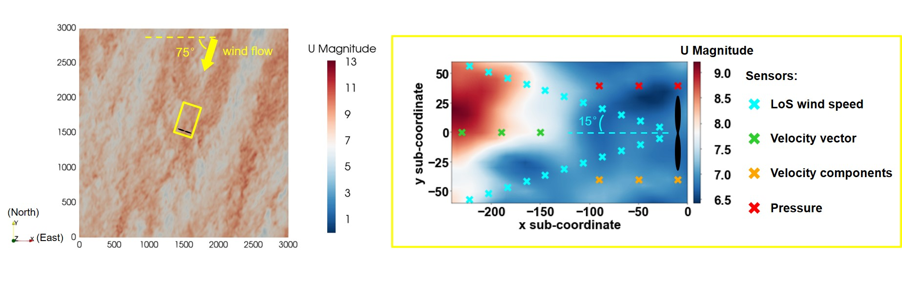
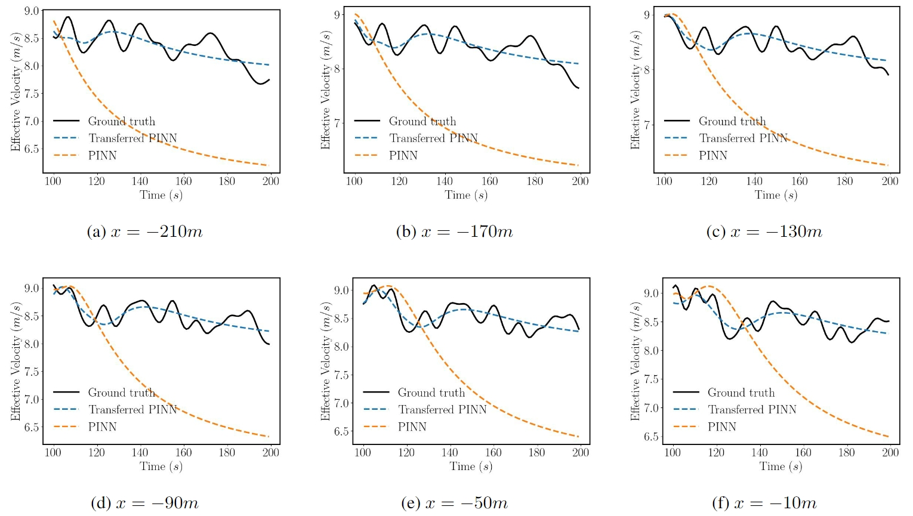

# A Framework of Data Assimilation for Wind Flow Field by Physics-informed Neural Networks
This repository contains the source code for the research presented in the paper [A Framework of Data Assimilation for Wind Flow Field by Physics-informed Neural Networks](https://xxxxxxxxxxxxxxxxxxxxxxxxxxxx.)

## Overview
The main program, `main.py`, is the training process, in which the [wandb](https://wandb.ai/site) is included to search the optimized hyperparameter automatically. Physics-informed Neural Network (PINN) is defined in `pinn_model.py` under the framework of [PyTorch](https://pytorch.org/). All the requirements are included in `requirement.txt`. Four commonly available types of measurement data are supported: LoS wind speed, velocity vector, velocity component, and pressure. Given the turbulent nature of atmospheric boundary layer flow, the Reynolds-Averaged Navier-Stokes (RANS) equations are employed as the flow governing equations. The turbulence eddy viscosity, ${\nu _t}$, is directly predicted as an output variable of the PINN. The `pred_write.py` is used to reconstruct the wind flow field by a trained PINN. The reconstructed flow field data is written into `.h5` files. The script `transfer.py` is used for online deployment of the pre-trained PINN, assimilating real-time measured data.

## Test case
The test wind flow field is an atmospheric boundary layer flow simulated by [SOWFA (Simulator fOr Wind Farm Applications)](https://www.nrel.gov/wind/nwtc/sowfa.html). The flow field within the horizontal plane upstream of the wind turbine site is chosen to be the test area of the proposed framework. 

Section 3.1 of the paper investigates the accuracy of assimilating different types of measurement data. The flow field reconstructed by the trained model in Case 8, as well as the error compared to the actual values, are presented as follows.

Since detailed flow field information is reconstructed, other flow field characteristics such as effective wind speed and instantaneous speed at a specific location can also be obtained.

## Transfer learning
The incorporation of transfer learning enables PINN to predict flow fields over extended periods. Historically, PINN has operated exclusively in an offline mode. This work presents a potential solution for online deployment. The pre-trained PINN is deployed online and then trained on the dataset of real-time measurement data over a certain period. The transfer learning duration required is less than the actual physical flow
time, yet the model achieves acceptable accuracy in reconstructing the flow field for this period. At the wind turbine site, the maximum error between the effective wind speed predicted online and the actual wind speed is only 3.7%. This represents a significant improvement compared to models that have not undergone transfer learning. Therefore, the proposed framework demonstrates its potential for online deployment, making it a viable component of wind turbine online control systems.

